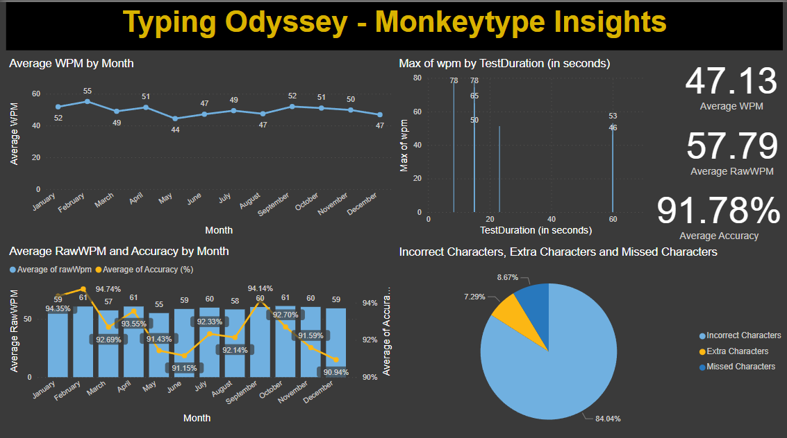

<h1>Typing Odyssey - Monkeytype Insights</h1>

<h2>Project Overview</h2>

This project visualizes and analyzes my personal typing performance data from Monkeytype. Monkeytype allows users to download their typing history as a CSV file. 
I cleaned, processed, and visualized the data to extract insights on performance trends, accuracy, error types, and personal bests.

<h2>Dataset Source</h2>
<ul>
  <li>Downloaded my personal typing data directly from <a href="https://monkeytype.com/" target="_blank">Monkeytype</a>.</li>
  <li>The dataset was provided in CSV format.</li>
</ul>

<h2>Data Cleaning and Preparation</h2>

<strong>Tools Used</strong>: Microsoft Excel, Power BI

<strong>Steps:</strong>

<ul>
  <li>Opened the CSV file in Excel.</li>
  <li>Removed irrelevant columns that were not useful for analysis.</li>
  <li>Split the <code>charStats</code> column into separate metrics.</li>
  <li>Saved the cleaned file as <code>.xlsx</code> format for Power BI.</li>
</ul>

In <strong>Power BI</strong>, further cleaning and preparation were done:

<ul>
  <li>Changed datatypes appropriately (e.g., numeric, boolean, text).</li>
  <li>Converted values into percentages where necessary by creating new calculated columns.</li>
  <li>Transformed the Unix-style <code>timestamp</code> into readable <strong>Date</strong> format (date only; time was ignored).</li>
  <li>Filled blank values in the <code>personalBest</code> column with <code>False</code>, interpreting blank as "not a personal best."</li>
  <li>Verified all columns and relationships before moving to visualization.</li>
</ul>

<h2>Visualizations</h2>

<strong>Dashboard Title:</strong>

<blockquote><strong>Typing Odyssey - Monkeytype Insights</strong></blockquote>

<strong>Charts and Visuals Created:</strong>

<ol>
  <li><strong>Line Chart</strong>: Average WPM by Month - Shows the trend of typing speed over time.</li>
  <li><strong>Combo Chart (Stacked Column + Line)</strong>: Average Raw WPM and Accuracy by Month - Compares raw typing speed with typing accuracy over time.</li>
  <li><strong>Stacked Column Chart</strong>: Average WPM by Test Duration - Analyzes how test duration (e.g., 15s vs 60s) impacts typing speed.</li>
  <li><strong>Pie Chart</strong>: Error Types (Incorrect Characters, Extra Characters, Missed Characters) - Visual breakdown of typing errors.</li>
  <li><strong>KPI Cards</strong>: 
    <ul>
      <li>Average WPM</li>
      <li>Average Raw WPM</li>
      <li>Average Accuracy</li>
    </ul>
  </li>
</ol>

<h2>Challenges and Decisions</h2>
<ul>
  <li><strong>ID Field</strong>: Kept the original alphanumeric <code>_id</code> field without converting it to sequential numbers because it had no impact on visualizations.</li>
  <li><strong>Personal Best Field</strong>: Created a clean version replacing blanks with <code>False</code> to maintain consistency.</li>
  <li><strong>Timestamp</strong>: Used only the date, not the time, to focus on trends over days and months.</li>
  <li><strong>Scatter Plot Exploration</strong>: Attempted scatter plots to explore consistency vs accuracy but decided not to include final correlation analysis as it was not providing strong new insights.</li>
</ul>

<h2>Final Thoughts</h2>

This project demonstrates practical data cleaning, modeling, and visualization skills, including real-world handling of:

<ul>
  <li>Blank values</li>
  <li>Data type corrections</li>
  <li>Aggregations</li>
  <li>Trend analysis</li>
  <li>Comparison and distribution insights</li>
</ul>

It offers a complete journey from raw data to a polished Power BI dashboard, making it a strong addition to a data analyst portfolio.

## 📸 Dashboard Snapshot

